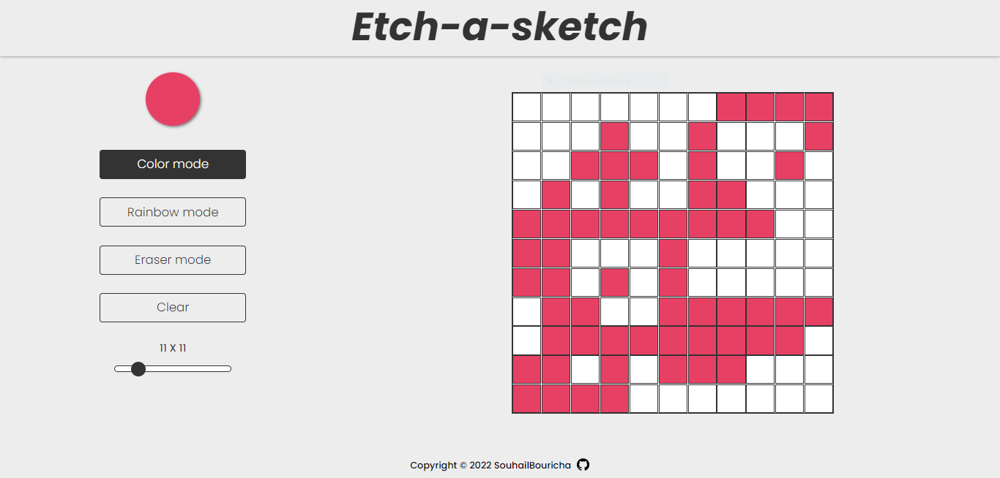

# Etch-A-Sketch 🚀

## Welcome! 👋

Thanks for checking out this repo.

- [x] 1 - Adding The Necessary Files
- [x] 2 - Create Elements And Style Them
- [x] 3 - Lot Off Styles
- [x] 4 - Create The Table
- [x] 5 - Fix The Colors
- [x] 6 - Update The Table

If you want to try a live show [click here](https://souhailbouricha.github.io/Etch-A-Sketch/) 😁
